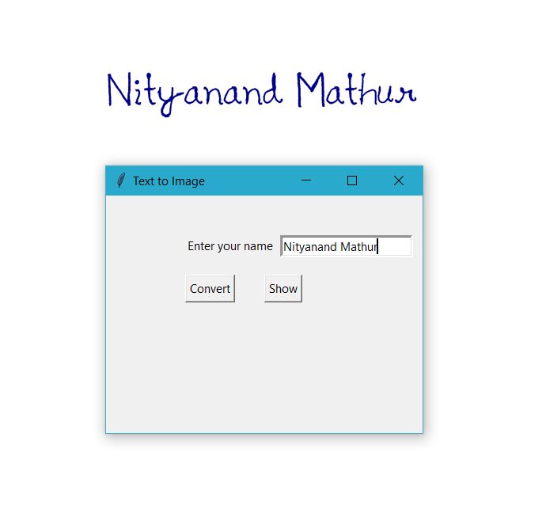
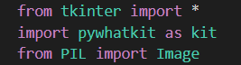

# textToHandWritten
This repository shows you how to create a GUI that converts a string(user-input) to handwriting.

**_Requirements :_**

- pywhatkit
- pyinstaller

# Instructions :-

## Pywhatkit

Install pywhatkit - "pip install pywhatkit"

PyWhatKit is a Python library for Sending whatsapp message at certain time. It has some other features too like to convert text to handwriting and to search on YouTube or Google.

## pyinstaller

Install pyinstaller - "pip install pyinstaller"

**_pyinstaller_** is used to convert **_.py_** file to **_.exe_** file.

#How to create GUI
1. Download the source code **_TexttoImg_** file.
   - This code uses **_tkinker_** for GUI generation and **_pywhatkit_** for converting text to       handwriting.
    
   - **_cnvsn_** method uses pyhatkit as **_kit.text_to_handwriting()_** to convert string to handwriting.
   - **_disp_** method opens image from the location where output file is saved. Need to be changed.
2. In the folder where the source code has been saved, open **_Powershell_** or **_Command Prompt_**.
3. Type - "pyinstaller --onefile -w 'TexttoImg.py'
4. You will get a directory looking like this - 

