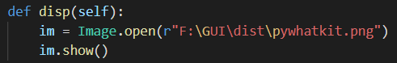

# textToHandWritten GUI
This repository shows you how to create a GUI that converts a string(user-input) to handwriting.

**_Requirements :_**

- pywhatkit
- pyinstaller

# Instructions :-

## Pywhatkit

Install pywhatkit - "pip install pywhatkit"

PyWhatKit is a Python library for Sending whatsapp message at certain time. It has some other features too like to convert text to handwriting and to search on YouTube or Google.

## pyinstaller

Install pyinstaller - "pip install pyinstaller"

**_pyinstaller_** is used to convert **_.py_** file to **_.exe_** file.

#How to create GUI
1. Download the source code **_TexttoImg_** file.
   - This code uses **_tkinker_** for GUI generation and **_pywhatkit_** for converting text to       handwriting.
    
   - **_cnvsn_** method uses pyhatkit as **_kit.text_to_handwriting()_** to convert string to handwriting.
   - **_disp_** method opens image from the location where output file is saved. Need to be changed.
2. Save the file in a new directory.
3. Now, copy the path of the folder.
4. Open the source code and go to **_disp_** method. Here, replace the preset path with the path you have copied.
5. At the end of your path type **_\dist\pywhatkit.png_**. Save the file. 
6. Now, open **_Powershell_** or **_Command Prompt_** in the directory where your source code is saved.
7. Type " pyinstaller --onefile -w 'TexttoImg.py'.
8. You will soon get your directory modified like this - 
9. Open the **_dist_** folder. VOILA..... You will get **_TexttoImg.exe_** here.
10. Open the file, enter the text and click on convert. After convert button reappers click on show to view your image containing text as handwriting.

Thanks for reading.
Hope this helps you.

Create an issue if you have any queries or reach me out at **_nityanandmathur@gmail.com_**.

